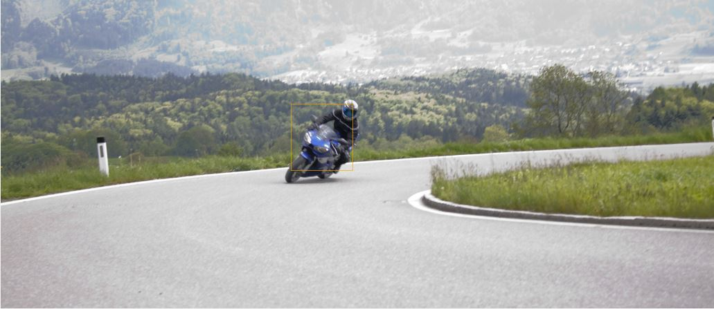

# Alturos.Yolo

A state of the art real-time object detection system for C# (Visual Studio). This project has CPU and GPU support, with GPU the detection works much faster. The primary goal of this project is an easy use of yolo, this package is available on nuget and you must only install two packages to start detection. In the background we are use the Windows Yolo version of [AlexeyAB/darknet](https://github.com/AlexeyAB/darknet). Send an image path or the byte array to [yolo](https://github.com/pjreddie/darknet) and receive the position of the detected objects. Our project is meant to return the object-type and -position as processable data.

## nuget
Quick install Alturos.Yolo over [nuget](https://www.nuget.org/packages/Alturos.Yolo)
```
PM> install-package Alturos.Yolo (c# wrapper and c++ dlls 22MB)
PM> install-package Alturos.YoloV2TinyVocData (Pre-Trained Dataset 56MB)
```

## Example result



Type | Confidence | X | Y | Width | Height |
--- | --- | --- | --- | --- | --- |
motorbike | 44.71 | 1932 | 699 | 411 | 441 |

## Example code

### Detect the type and the position of an image
```cs
var configurationDetector = new ConfigurationDetector();
var config = configurationDetector.Detect();
//using (var yoloWrapper = new YoloWrapper("yolov2-tiny-voc.cfg", "yolov2-tiny-voc.weights", "voc.names"))
using (var yoloWrapper = new YoloWrapper(config))
{
	var items = yoloWrapper.Detect(@"image.jpg");
	//items[0].Type -> "Person, Car, ..."
	//items[0].Confidence -> 0.0 (low) -> 1.0 (high)
	//items[0].X -> bounding box
	//items[0].Y -> bounding box
	//items[0].Width -> bounding box
	//items[0].Height -> bounding box
}
```

## System requirements
- .NET Framework 4.6.1
- [Microsoft Visual C++ 2017 Redistributable x64](https://go.microsoft.com/fwlink/?LinkId=746572)

## GPU requirements (optional)
1) [Install Nvidia CUDA Toolkit 9.2](https://developer.nvidia.com/cuda-downloads) (must be installed add a hardware driver for cuda support)
2) [Download Nvidia cuDNN v7.1.4 for CUDA 9.2](https://developer.nvidia.com/rdp/cudnn-download) (DLL cudnn64_7.dll required for gpu processing)

## Build requirements
- Visual Studio 2017

## Benchmark / Performance (processing of one image 1024x683)

### CPU

Processor | yolo v2 tiny voc | yolo v2 | yolo 9000 |
--- | --- | --- | --- | 
Intel i7 3770 (with OpenMP) | 557 ms | - | - | 
Intel i7 3770 (without OpenMP) | 1155 ms | - | - | 

### GPU

Graphic card | Single precision | Memory | Slot | yolo v2 tiny voc | yolo v2 | yolo 9000 |
--- | --- | --- | --- | --- | --- | --- |
NVIDIA Quadro K420 | 300 GFLOPS | 2 GB | Single | 94 ms | 296 ms | 640 ms |
NVIDIA Quadro K620 | 768 GFLOPS | 2 GB | Single | - | - | - |
NVIDIA Quadro K1200 | 1151 GFLOPS | 4 GB | Single | - | - | - |
NVIDIA Quadro P400 | 599 GFLOPS | 2 GB | Single | - | - | - |
NVIDIA Quadro P600 | 1117 GFLOPS | 2 GB | Single | - | - | - |
NVIDIA Quadro P620 | 1386 GFLOPS | 2 GB | Single | - | - | - |
NVIDIA Quadro P1000 | 1862 GFLOPS | 4 GB | Single | - | - | - |
NVIDIA Quadro P2000 | 3011 GFLOPS | 5 GB | Single | - | - | - |
NVIDIA Quadro P4000 | 5304 GFLOPS | 8 GB | Single | - | - | - |
NVIDIA Quadro P5000 | 8873 GFLOPS | 16 GB | Dual | - | - | - |
NVIDIA GeForce GT 710 | 366 GFLOPS | 2 GB | Single | - | - | - |
NVIDIA GeForce GT 730 | 693 GFLOPS | 2-4 GB | Single | - | - | - |
NVIDIA GeForce GT 1030 | 1098 GFLOPS | 2 GB | Single | 23 ms | 64 ms| 180 ms |
NVIDIA GeForce GTX 1060 | 4372 GFLOPS | 6 GB | Dual | - | - | - |


## Pre-Trained Dataset
Model | Cfg | Weights | Names |
--- | --- | --- | --- |
YOLOv3-416 | [yolov3.cfg](https://github.com/pjreddie/darknet/blob/master/cfg/yolov3.cfg) | [yolov3.weights](https://pjreddie.com/media/files/yolov3.weights) | [coco.names](https://github.com/pjreddie/darknet/blob/master/data/coco.names) |
YOLOv3-tiny | [yolov3-tiny.cfg](https://github.com/pjreddie/darknet/blob/master/cfg/yolov3-tiny.cfg) | [yolov3.weights](https://pjreddie.com/media/files/yolov3.weights) | [coco.names](https://github.com/pjreddie/darknet/blob/master/data/coco.names) |
YOLOv2 608x608 | [yolov2.cfg](https://github.com/pjreddie/darknet/blob/master/cfg/yolov2.cfg) | [yolov2.weights](https://pjreddie.com/media/files/yolov2.weights) | [coco.names](https://github.com/pjreddie/darknet/blob/master/data/coco.names) |
Tiny YOLO | [yolov2-tiny.cfg](https://github.com/pjreddie/darknet/blob/master/cfg/yolov2-tiny.cfg) | [yolov2-tiny.weights](https://pjreddie.com/media/files/yolov2-tiny.weights) | [voc.names](https://github.com/pjreddie/darknet/blob/master/data/voc.names) |
yolo9000 | [darknet9000.cfg](https://github.com/pjreddie/darknet/blob/master/cfg/darknet9000.cfg) | [yolo9000.weights](https://github.com/philipperemy/yolo-9000/tree/master/yolo9000-weights) | [9k.names](https://github.com/pjreddie/darknet/blob/master/data/9k.names) |

## Annotation Tool

To marking bounded boxes of objects in images for training neural network you can use [VoTT](https://github.com/Microsoft/VoTT)

## Debuging Gpu Tool

Check graphic device usage C:\Program Files\NVIDIA Corporation\NVSMI>nvidia-smi

## Dataset of tagged images

http://cocodataset.org/
